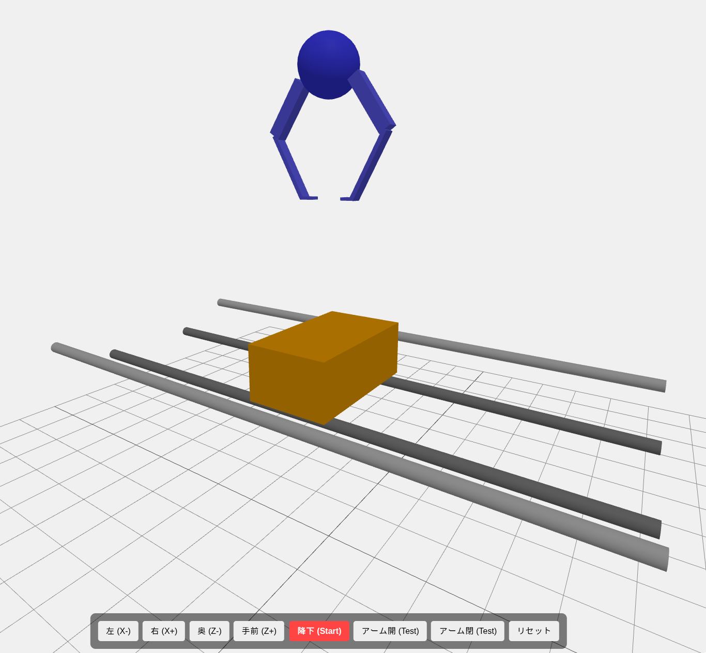

# Crane Simulator (橋渡しシミュレーター)



クレーンゲームの「橋渡し」設定を物理演算で再現した 3D シミュレーターです。
景品の重み、アームの閉じ力、棒との摩擦などの物理的な相互作用を検証・体験することを目的としています。

## 🚀 動作環境 & セットアップ

### 開発スタック
- **Engine:** [Three.js](https://threejs.org/) (Rendering)
- **Physics:** [cannon-es](https://pmndrs.github.io/cannon-es/) (Physics Engine)
- **Bundler:** [Vite](https://vitejs.dev/)
- **Language:** TypeScript

### セットアップ手順
1.  依存パッケージのインストール:
    ```bash
    npm install
    ```
2.  開発サーバーの起動:
    ```bash
    npm run dev
    ```
3.  ブラウザで表示された URL（デフォルトは `http://localhost:5173`）にアクセスしてください。

## 🕹 操作方法
画面上の UI ボタンを使用してクレーンを操作します。

- **移動ボタン:** クレーンを前後左右（X, Z軸）に移動させます。
- **降下 (Start):** 降下・開閉・上昇の一連のシーケンスを開始します。
- **アーム開/閉 (Test):** アームの開閉動作のみを単体でテストします。
- **リセット:** 景品とクレーンを初期位置に戻します。

## 🛠 開発者向け解説

### 物理制御の仕組み
本プロジェクトでは、よりリアルな挙動を実現するために以下の物理実装を行っています。

- **トルク制御によるアーム開閉:** 
  アームの開閉には `HingeConstraint` のモーターではなく、目標角度との差分に基づいた直接的なトルク (`applyTorque`) を適用しています。これにより、景品の抵抗や摩擦に負ける「適度な閉じ力」を再現しています。
- **衝突フィルタリング:** 
  アーム同士や本体が互いに干渉してロックされないよう、`collisionFilterGroup` を用いて、アームが反応する対象を「景品」と「橋の棒」に限定しています。
- **摩擦マテリアル:** 
  橋のメイン棒、ガードレール、アーム、景品のそれぞれに異なる摩擦係数を設定し、戦略的な滑りを表現しています。

### 主要な調整定数 (`src/main.ts`)
以下の定数を変更することで、ゲームバランスを調整できます。

- `CLOSED_ANGLE`: 閉じた際のアームの目標角度（先端の隙間調整）。
- `ARM_POWER`: アームの閉じる力の強さ。
- `MOTOR_FORCE`: トルク適用の最大制限。
- `mass`: 景品の重さ。
- `friction`: 各オブジェクト間の滑りやすさ。

## 📂 ディレクトリ構造
- `index.html`: UI レイアウト。
- `src/main.ts`: シミュレーターのコアロジック（物理演算、描画、UI連携）。
- `src/style.css`: UI のスタイリング。
- `public/`: 静的アセット（画像等）。
